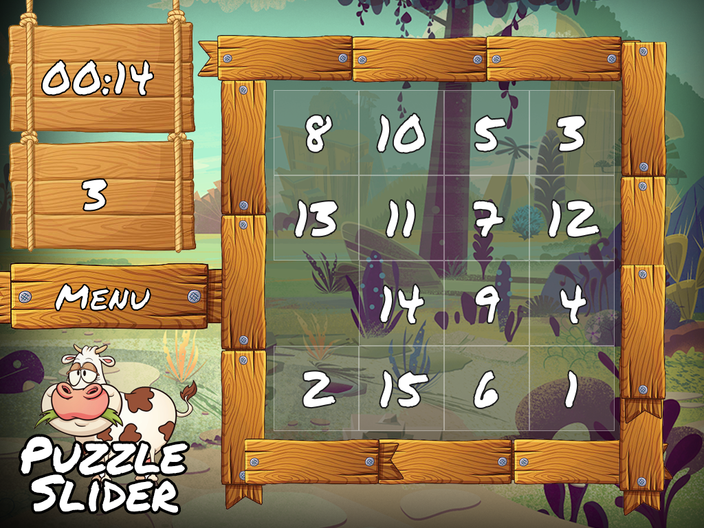

# Puzzle slider

Máme štvorcovú plochu `N×N` a v nej `N×N-1` čísel a jedno voľné miesto. Cieľom hry je usporiadať čísla do postupnosti alebo poskladať rozsekaný obrázok pričom vždy je možné meniť iba políčka susedné s voľným miestom.

## O projekte

Tento projekt je súčasťou predmetu extrémne programovanie na FMFI UK.

## Autori

Samuel Mitas, Alexander Szendy, Filip Kováč, Martin Šomodi, Tomáš Bakoš, Matúš Kováč
